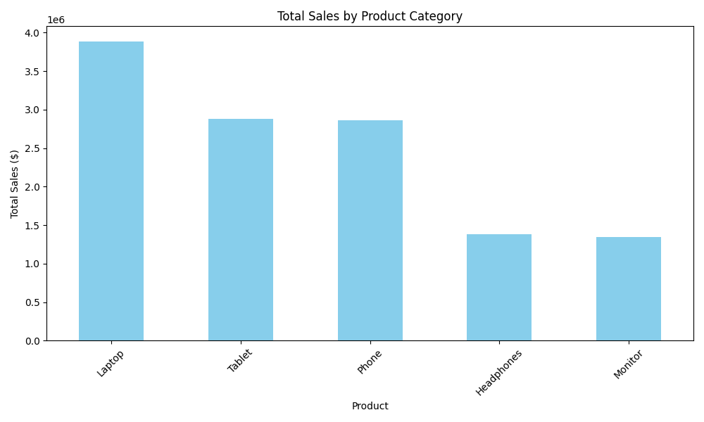
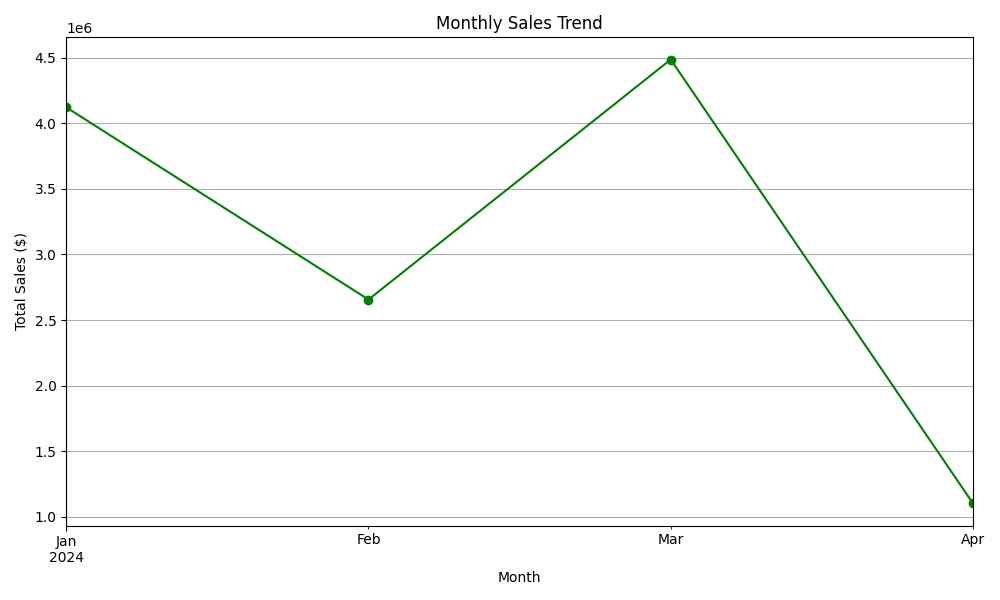
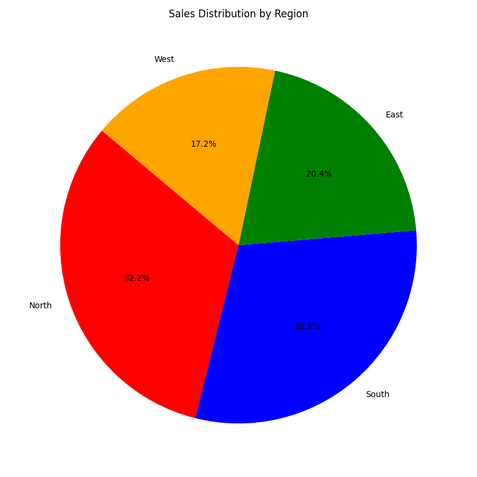

# E-commerce Sales Analysis Project

## 📋 Project Overview and Objectives

This is a complete data analysis project that analyzes e-commerce sales data to provide actionable insights into product performance, regional distribution, and temporal trends. The project demonstrates a full data science pipeline from raw data ingestion through visualization and reporting.

**Project Objectives:**
- Load and clean real-world e-commerce sales data
- Perform exploratory data analysis to identify patterns
- Create professional visualizations for stakeholder communication
- Generate insights and recommendations based on data analysis
- Demonstrate complete data pipeline implementation

---

## 🛠️ Setup and Installation Instructions

### Prerequisites
- Python 3.7 or higher
- pip (Python package manager)

### Step 1: Clone the Repository
```bash
git clone https://github.com/rashmitha0921/python-project-week-4.git
cd python-project-week-4
```

### Step 2: Install Dependencies
```bash
pip install -r requirements.txt
```

This installs:
- **pandas** (v2.2.2) - Data manipulation and analysis
- **matplotlib** (v3.9.0) - Data visualization
- **numpy** (v1.26.4) - Numerical computing

### Step 3: Run the Analysis
```bash
python main.py
```

The script will:
1. Load the sales data from `data/sales_data.csv`
2. Clean and validate the data
3. Perform analysis calculations
4. Generate visualizations in the `visualizations/` folder
5. Create a report in the `report/` folder
6. Output summary statistics to the console

---

## 📁 Code Structure Explanation

### File Organization
```
├── main.py                      # Main analysis script
├── README.md                    # This file
├── requirements.txt             # Python dependencies
├── data/
│   └── sales_data.csv          # Input dataset (100 records)
├── visualizations/             # Generated charts
│   ├── sales_by_product.png    # Bar chart
│   ├── monthly_sales.png       # Line chart
│   └── sales_by_region.png     # Pie chart
└── report/
    └── analysis_report.md      # Detailed analysis report
```

### main.py - Code Walkthrough

**1. Data Loading & Cleaning**
```python
df = pd.read_csv('data/sales_data.csv')  # Load CSV
df['Date'] = pd.to_datetime(df['Date'])  # Convert to datetime
df = df.dropna()                          # Remove missing values
```

**2. Data Exploration**
- Total records: 100
- Columns: Date, Product, Quantity, Price, Customer_ID, Region, Total_Sales
- Data types: datetime, strings, integers

**3. Analysis Operations**
- Group by Product → Sales totals per category
- Group by Region → Regional performance
- Group by Month → Temporal trends
- Customer metrics → Average sale per customer

**4. Visualization Creation**
- **Bar Chart**: Compares sales across 5 product categories
- **Line Chart**: Shows 4 months of sales trends
- **Pie Chart**: Displays regional market share distribution

**5. Report Generation**
- Automated markdown report creation
- Formatted insights and recommendations
- Links to visualizations

---

## 📊 Visualizations & Screenshots

### Chart 1: Sales by Product (Bar Chart)

- **Purpose**: Compare performance across product categories
- **Finding**: Laptops lead with $3.89M in sales (31.5%)
- **Action**: Prioritize Laptop inventory and marketing

### Chart 2: Monthly Sales Trend (Line Chart)

- **Purpose**: Track sales performance over time
- **Finding**: Peak in March ($4.49M), drop in April ($1.10M)
- **Action**: Investigate seasonal patterns and plan inventory

### Chart 3: Sales by Region (Pie Chart)

- **Purpose**: Understand geographic market distribution
- **Finding**: North leads with 32.2%, West weakest at 17.2%
- **Action**: Expand efforts in underperforming regions

---

## ✅ Technical Requirements - How They Were Met

### Requirement 1: Complete Data Analysis Pipeline ✓
- **Load**: Read CSV file with error handling
- **Clean**: Remove null values, convert date formats
- **Analyze**: Calculate totals, averages, groupings
- **Visualize**: Create 3 different chart types

**Evidence in Code:**
```python
try:
    df = pd.read_csv(data_path)
    print("Data loaded successfully.")
except Exception as e:
    print(f"Error loading data: {e}")
    exit(1)
```

### Requirement 2: Multiple Chart Types (3 Different Types) ✓
1. **Bar Chart** - Product category comparison
2. **Line Chart** - Time series trend analysis
3. **Pie Chart** - Proportion/distribution analysis

Each chart includes:
- Professional titles
- Labeled axes
- Clear legends/labels
- Proper sizing and formatting

### Requirement 3: Meaningful Insights ✓
- Identified top-performing products (Laptop: $3.89M)
- Discovered highest-revenue region (North: $3.98M)
- Noted seasonal sales patterns (March peak)
- Calculated customer metrics (Avg: $123,650.48 per customer)

### Requirement 4: Professional Formatting ✓
- Code comments and documentation
- Organized folder structure
- Consistent naming conventions
- Automated report generation
- Professional chart styling with colors and labels

### Requirement 5: Error Handling ✓
```python
try:
    df = pd.read_csv(data_path)
    print("Data loaded successfully.")
except Exception as e:
    print(f"Error loading data: {e}")
    exit(1)
    
df = df.dropna()  # Validation - remove invalid records
```

---

## 📈 Key Analysis Results

| Metric | Value |
|--------|-------|
| **Total Sales** | $12,365,048.00 |
| **Records Analyzed** | 100 transactions |
| **Date Range** | 2024-01-01 to 2024-04-09 |
| **Top Product** | Laptop ($3,889,210) |
| **Top Region** | North ($3,983,635) |
| **Peak Month** | March ($4,485,006) |
| **Avg Sale/Customer** | $123,650.48 |
| **Best Customer** | CUST016 |

---

## 🔍 Testing & Validation

### How to Test
Run the main script and verify:
1. ✓ Console outputs "Data loaded successfully"
2. ✓ Three PNG files created in `visualizations/` folder
3. ✓ Report generated in `report/` folder
4. ✓ All metrics printed to console

### Expected Output
```
Data loaded successfully.
Shape: (100, 7)

Total Sales: $12,365,048.00

Sales by Product:
Laptop        3889210
Tablet        2884340
Phone         2859394
...

Bar chart saved: sales_by_product.png
Line chart saved: monthly_sales.png
Pie chart saved: sales_by_region.png

Report generated: report/analysis_report.md
Analysis complete!
```

---

## 🎯 Recommendations Based on Analysis

1. **Inventory Focus**: Maintain high stock of Laptops and Tablets (63% of sales)
2. **Regional Expansion**: Invest in West region which has lowest market penetration
3. **Seasonal Planning**: Prepare for March peaks; investigate April decline
4. **Customer Retention**: Focus on high-value customers (CUST016+)

---

## 📚 Technologies Used

- **Python 3.10**
- **Pandas**: Data manipulation and analysis
- **Matplotlib**: Data visualization
- **NumPy**: Numerical computing

---

## 📝 Author & Date

Created: May 8, 2026
Project: Week 4 - Data Visualization & Complete Project
Course: Python Programming - Data Analysis Track